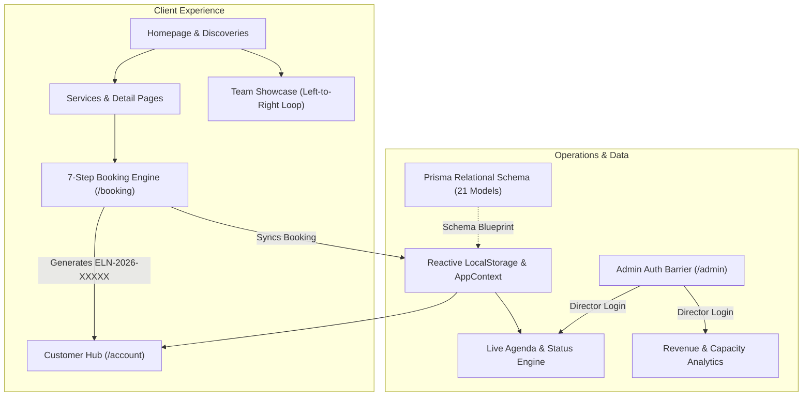

<div align="center">

# ✨ É L A N E
### Haute Beauté & Grooming Atelier — Sliema, Malta

*A bespoke commercial-grade digital flagship, guest booking engine, and salon operations suite engineered for contemporary Mediterranean luxury.*

<br/>

[](https://elane-salon-malta.vercel.app)
[](https://github.com/ishruq1317/elane-salon-malta)

<br/>

[](https://nextjs.org/)
[](https://www.typescriptlang.org/)
[](https://tailwindcss.com/)
[](https://www.framer.com/motion/)
[](https://www.prisma.io/)
[](LICENSE)

<br/>

**[🌐 Visit Live Atelier](https://elane-salon-malta.vercel.app)** &nbsp;•&nbsp;
**[✨ Experience Highlights](#-key-experience-highlights)** &nbsp;•&nbsp;
**[🛠️ System Architecture](#️-system-architecture)** &nbsp;•&nbsp;
**[🔒 Admin Access](#-demo-credentials)** &nbsp;•&nbsp;
**[🚀 Local Setup](#-local-development)**

---

</div>

<br/>

## ⚜️ Project Overview

**ÉLANE** is an enterprise-caliber digital presence and salon management SaaS crafted for an upscale European hair, aesthetics, and grooming sanctuary situated at **123 Triq il-Kbira, Sliema, Malta**.

Built with **Next.js 14 (App Router)**, **TypeScript**, and **Tailwind CSS**, the platform merges high-fashion editorial aesthetics with a complete, production-ready salon business operations workflow. It accommodates both in-atelier treatments and an island-wide mobile concierge catering to luxury residences, mega-yachts, and hotels across Malta and Gozo.

---

## ✨ Key Experience Highlights

### 🎨 1. Editorial Luxury & Motion Micro-Interactions
- **Fluid Route Transitions**: A champagne gold sweep line tracks route changes across the top header, while Framer Motion's shared `layoutId` physically slides the active navigation pill across tabs.
- **Title Cursor Micro-Interactions**: Hovering over menu titles triggers a delicate upward micro-lift, an expanding hairline underline, and a glowing gold accent dot.
- **Harmonic Before/After Animatic Slider**: Autonomous back-and-forth comparison sweep operating on a sinusoidal harmonic curve (`Math.sin()`), smoothly revealing hair transformations with touch/drag support.
- **Continuous Quick Discovery Marquee**: Ultra-wide, hands-free circular loop gliding continuously from **right to left** (68s duration) across all salon categories.

### 👥 2. Animated Team Showcase & 3D Pop-Up
- **Continuous Left-to-Right Loop**: Master stylists and aestheticians showcased in an uninterrupted 52s marquee track gliding smoothly from **left to right**.
- **Pronounced 3D Picture Pop-Up**: Cursor hover elevates cards by `-1rem` (`-translate-y-4`), scales the frame (`scale-[1.03]`), magnifies the portrait (`scale-110`), and casts a warm champagne gold halo (`ring-gold/30`, `shadow-2xl`).
- **Profile-Only Sanctuary**: Strictly free of commercial booking spam—clicking opens an editorial biography highlighting European training, disciplines, and Instagram handles.

### 📅 3. Multi-Channel 7-Step Interactive Booking Engine (`/booking`)
- **Step 1**: Category & Service selection (Balayage, Cuts, Dermal Therapies, Russian Manicures, Hot-Towel Barbery).
- **Step 2**: Specialist selection (choose specific master or *"Any Available"*).
- **Step 3**: Location fulfillment:
  - **Sliema Atelier** (123 Triq il-Kbira).
  - **Malta Home Concierge** (automatic travel fee calculation across Zone 1 Sliema, Zone 2 Valletta, Zone 3 Central/North, Zone 4 Gozo).
- **Step 4 & 5**: Real-time interactive calendar date and morning/afternoon slot picker.
- **Step 6 & 7**: Guest details and instant reservation confirmation with unique reference code (`ELN-2026-XXXXX`), celebratory confetti, and one-click Google Calendar / iCal export.

### 👤 4. Client Relationship Hub (`/account`)
- Real-time synchronization of upcoming reservations with **Reschedule** and **Cancel** actions.
- Post-service **Verified Review** modal with star ratings and client testimonials.
- Saved wishlist services and personal beauty profile.

### 🛡️ 5. Gated Salon Operations SaaS Suite (`/admin`)
- **Credential-Gated Security**: Strict authentication barrier protecting business agenda, staff rosters, and financial records.
- **Real-Time Operations Agenda**: Instant status toggles (*Confirmed*, *Completed*, *Rescheduled*, *Cancelled*).
- **Scheduled Revenue & Staff Shifts**: Daily capacity analytics, roster scheduling, and wedding/event quote pipelines.

---

## 🛠️ System Architecture



---

## 🔒 Demo Credentials

The platform includes simulated roles for immediate end-to-end evaluation:

| Portal | Role | Access Identifier | Password | Access Location |
| :--- | :--- | :--- | :--- | :--- |
| **Client Hub** | Emma Borg (Client) | `client@elanesalon.com` | *Session Active* | Top Navigation → User Icon (`/account`) |
| **Salon Operations** | Julian Camilleri (Director) | `admin@elanesalon.com` | `admin123` | Top Navigation → Shield Icon (`/admin`) |

---

## 💻 Tech Stack & Design Tokens

| Technology | Role |
| :--- | :--- |
| **Framework** | [Next.js 14](https://nextjs.org/) (App Router, React 18 Server & Client Components) |
| **Language** | [TypeScript 5](https://www.typescriptlang.org/) (Strict type checking, 0 errors) |
| **Styling** | [Tailwind CSS 3.4](https://tailwindcss.com/) with custom luxury color palette |
| **Animation** | [Framer Motion 11](https://www.framer.com/motion/) + GPU CSS `@keyframes` |
| **Icons** | [Lucide React](https://lucide.dev/) |
| **Database Blueprint** | [Prisma ORM](https://www.prisma.io/) (PostgreSQL 21-model schema) |
| **Hosting & Edge** | [Vercel Global Edge Network](https://vercel.com) |

### 🎨 Brand Palette Tokens
- **Charcoal Espresso**: `#171513` — *Deep grounding typography & structural accents*
- **Warm Ivory**: `#FAF7F2` — *Luminous editorial canvas*
- **Soft Sand**: `#DED4C7` — *Subtle borders, dividers & pill tags*
- **Muted Taupe**: `#A99B8B` — *Supporting editorial metadata & subheadings*
- **Champagne Gold**: `#B99A68` — *Signature highlights, active states & badges*
- **Mediterranean Olive**: `#4E5548` — *Botanical therapies & assurance notices*

---

## 🚀 Local Development

Follow these steps to run the atelier platform locally:

```bash
# 1. Clone the repository
git clone https://github.com/ishruq1317/elane-salon-malta.git

# 2. Navigate to directory
cd elane-salon-malta

# 3. Install dependencies
npm install

# 4. Start development server
npm run dev
```

Open [http://localhost:3000](http://localhost:3000) in your browser.

```bash
# Run type checks
npx tsc --noEmit

# Build production bundle
npm run build
```

---

## 📁 Repository Directory Map

```
elane-salon-malta/
├── prisma/
│   └── schema.prisma             # PostgreSQL schema (21 models: Booking, Staff, Service...)
├── public/                       # High-resolution brand assets & photography
├── src/
│   ├── app/                      # Next.js App Router
│   │   ├── page.tsx              # Atelier Homepage (Hero, Marquee, Team, Before/After)
│   │   ├── about/                # Atelier heritage & master collective
│   │   ├── services/             # Complete treatment menu & dynamic [slug] pages
│   │   ├── women/                # Balayage, couture styling & dermal facials
│   │   ├── men/                  # Precision fades & hot-towel grooming suite
│   │   ├── kids/                 # Gentle junior & teen styling
│   │   ├── home-service/         # Malta island-wide concierge & zones map
│   │   ├── events/               # Bridal & wedding quote inquiry engine
│   │   ├── shop/                 # Boutique formulations & cart drawer
│   │   ├── booking/              # 7-Step client booking wizard
│   │   ├── account/              # Customer dashboard & appointment manager
│   │   └── admin/                # Gated salon operations suite
│   ├── components/
│   │   ├── layout/               # Dynamic Navbar with sliding layoutId & Footer
│   │   ├── home/                 # Autonomous marquees, Before/After sine sweep
│   │   ├── team/                 # Left-to-right team loop & 3D pop-up modal
│   │   └── shared/               # Concise service cards, cart drawer, modals
│   ├── context/                  # Persisted AppContext with localStorage sync
│   └── data/                     # Service catalogue, master stylists & verified reviews
└── tailwind.config.ts            # Custom Mediterranean luxury design tokens
```

---

<div align="center">

**ÉLANE Haute Beauté & Grooming Atelier** • 123 Triq il-Kbira, Sliema, Malta  
*Crafted with precision, care, and Mediterranean individuality.*

[](https://elane-salon-malta.vercel.app)

</div>
